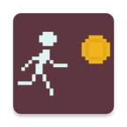
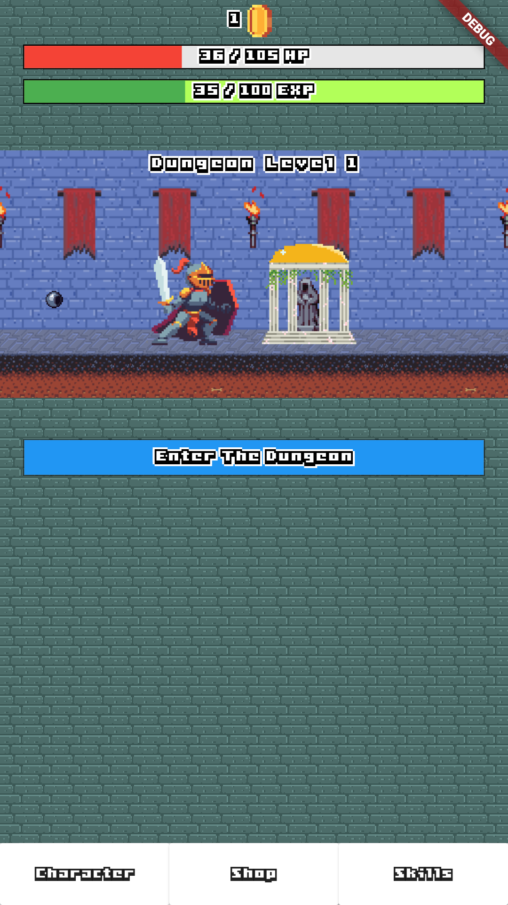
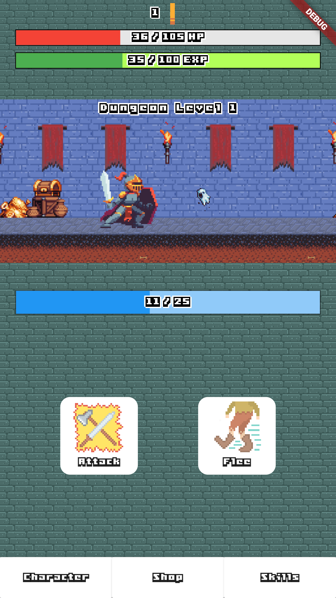
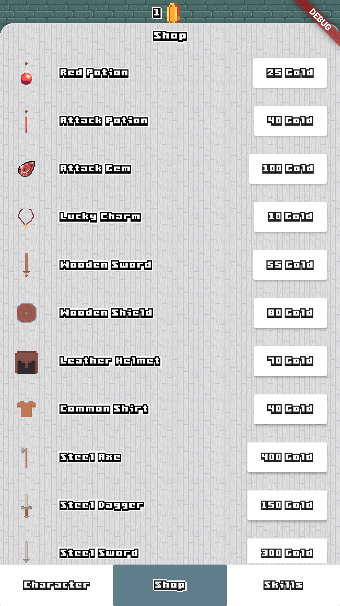
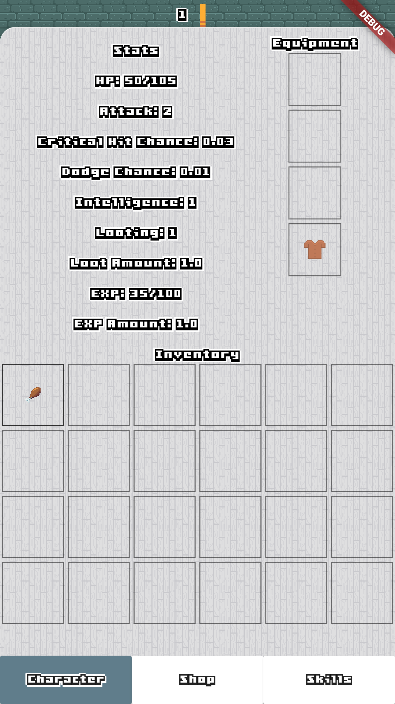
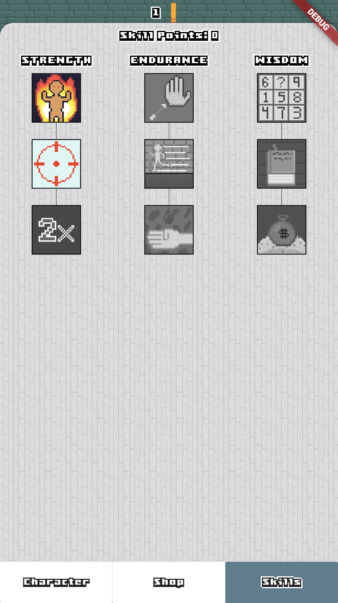

# Loot Clicker

An Android clicker game made entirely within Flutter. No game engine needed.
Used [bloc](https://github.com/felangel/bloc) pattern to manage state.

## Features

- [x] Dungeon Scrolling
- [x] Inventory
- [x] Shop
- [x] Skills
- [ ] Level unique content
- [ ] Music & sfx
- [ ] Achievements
- [ ] Quests
- [ ] Enemy loot drops
- [ ] Random events
- [ ] Automatic clicking upgrade
- [ ] Classes
- [ ] Icon redesign
- [ ] Sprite animations

## Screenshots

